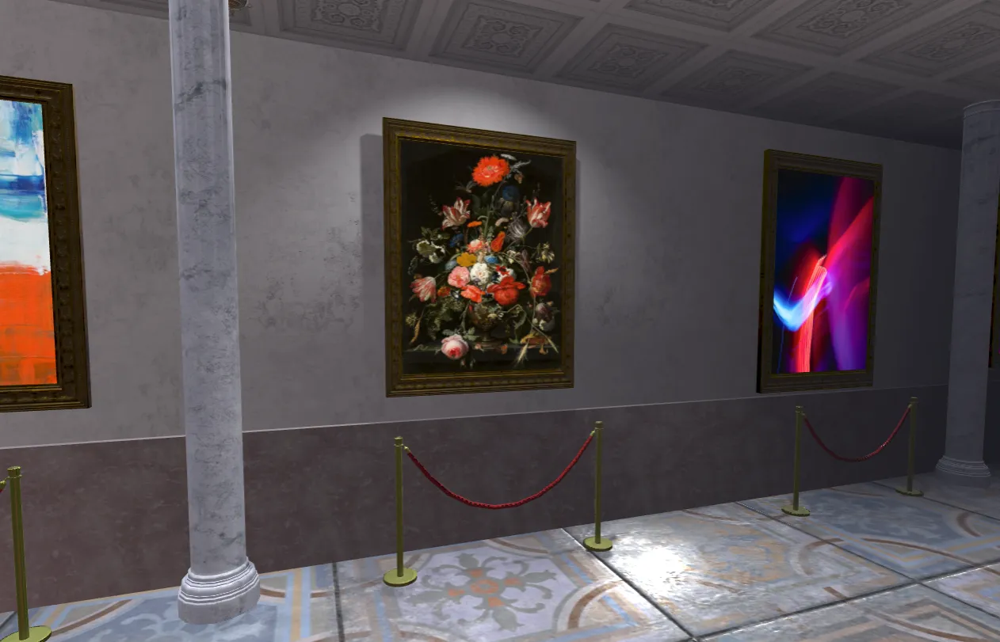

# Kazuma Kuramoto Portfolio



## Overview

This is a personal portfolio website for Kazuma Kuramoto. Built with Next.js, React Three Fiber, and Framer Motion, it showcases professional experience, projects, and skills in an interactive and visually engaging manner.

## Tech Stack

- **Frontend**:
  - Next.js 13
  - React 18
  - TypeScript
  - TailwindCSS
  - React Three Fiber / Three.js
  - Framer Motion
  - Lucide React (icons)
  - shadcn/ui (UI components)

## Features

- 🚀 **Interactive 3D Hero Section**: Immersive 3D experience using React Three Fiber
- 🎨 **Responsive Design**: Fully responsive from mobile to desktop devices
- ✨ **Smooth Animations**: Polished animations and transitions with Framer Motion
- 📱 **Optimized Performance**: Fast loading times and excellent user experience
- 📊 **Project Showcase**: Display of past work and personal projects with detailed descriptions
- 💼 **Professional Experience**: Overview of skills and professional background
- 🔗 **Social Links**: Connections to GitHub, LinkedIn, and other platforms
- 📄 **Downloadable Resume**: Easy access to professional resume

## Setup

### Prerequisites

- Node.js 16.8.0 or later
- npm or yarn

### Installation

```bash
# Clone the repository
git clone https://github.com/Kazumakr/portfolio.git
cd portfolio

# Install dependencies
npm install
# or
yarn
```

### Starting the Development Server

```bash
npm run dev
# or
yarn dev
```

The site will be available at http://localhost:3000.

## Build & Deploy

```bash
# Create a production build
npm run build
# or
yarn build

# Run the build
npm run start
# or
yarn start
```

## Project Structure

```
portfolio/
├── app/                  # Next.js app directory
│   ├── page.tsx          # Main page component
│   └── ...               # Other app files
├── components/           # React components
│   ├── About.tsx         # About section
│   ├── Navigation.tsx    # Navigation bar
│   ├── Scene.tsx         # 3D scene component
│   └── ...               # Other components
├── public/               # Static files
│   ├── images/           # Image files
│   └── fonts/            # Font files
└── ...                   # Config files
```

## Customization

- `app/page.tsx`: Main content and configuration
- `components/`: Reusable components
- `public/`: Static files like images, resume, etc.

## Notes

This portfolio template is intended for personal use. If you plan to use it for commercial purposes, please check the necessary licenses.

## License

MIT License

## Created By

[Kazuma Kuramoto](https://github.com/Kazumakr)
